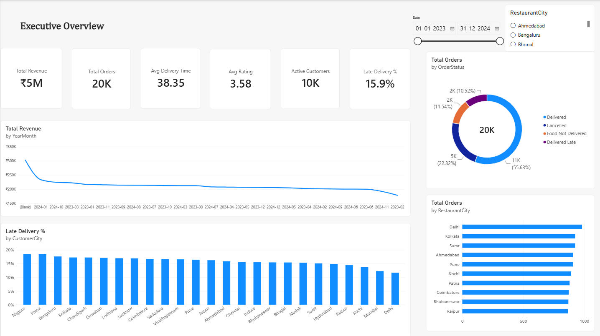

# Zomato Business Intelligence & Delivery Prediction

An end-to-end analytics project on a two-year Zomato-style food-delivery dataset (Jan 2023 – Dec 2024):
data cleaning → SQL → analytical tables → EDA → machine learning → Power BI.

---

## Project Overview

The project takes 12 raw, messy CSV tables (orders, customers, restaurants, delivery partners, payments,
weather, traffic, etc.), cleans them, and builds **three analytical tables** that feed everything else:
exploratory analysis, two ML models, and a six-page Power BI dashboard.

## Business Problem

- Where does revenue come from (city, cuisine, restaurant, time of day)?
- Why do so many orders fail (cancelled, not delivered, late)?
- Can delivery time be predicted from traffic, weather, basket and partner information?
- Can customers who are about to stop ordering be identified early?

## Architecture

```
data/raw/*.csv  (12 messy source tables)
      │   src/ingest.py  +  src/clean.py
      ▼
data/cleaned/*.csv  (12 cleaned tables)
      │   src/features.py   (notebook 02)
      ▼
data/analytical/  order_analytics · customer_analytics · restaurant_analytics
      │
      ├──► EDA (notebook 03)          → images/eda/   (30 charts)
      ├──► Delivery ML (notebook 04)  → models/, outputs/
      ├──► Churn ML (notebook 05)     → models/, outputs/
      └──► Power BI                   → powerbi/
```

The key design choice: **data is prepared once** (the analytical layer) and reused by EDA, ML and
Power BI, so all three always agree.

## Dataset

| Table | Grain | Rows |
|---|---|---|
| `order_analytics.csv` | 1 row = 1 order | 20,475 |
| `customer_analytics.csv` | 1 row = 1 customer (with churn label) | 9,254 |
| `restaurant_analytics.csv` | 1 row = 1 restaurant | 1,200 |

Column definitions: [`documentation/feature_dictionary.md`](documentation/feature_dictionary.md)

## Data Cleaning

Rule followed throughout: **fix what is clearly wrong, never guess what is missing.** Ambiguous dates,
negative amounts, duplicate rows and inconsistent city names are handled in `src/clean.py`; every
decision is logged in `documentation/cleaning_decisions_Profiling.csv`.
See [`documentation/cleaning_guide.md`](documentation/cleaning_guide.md).

## Analytical Dataset

Built by `src/features.py` (called from `notebooks/02_analytical_dataset.ipynb`), with 25+ engineered
features: temporal (hour, weekend, peak hour), customer (tenure, lifetime value, recency), restaurant
(popularity, revenue rank, performance score), delivery (efficiency, traffic score, rain impact) and more.
Quality checks are in `outputs/data_quality_report.csv`.

## SQL Analysis

`sql/schema.sql` — 12 tables, foreign keys, check constraints, and **15 indexes** on the columns used
for joins and filters (customer/restaurant/date lookups).

`sql/data_quality_checks.sql` — row counts, orphan-key checks, duplicate checks, and range checks
(ratings, costs, delivery times) for every table.

`sql/business_queries.sql` — **27 labelled business queries** (A1–H4) covering revenue by
restaurant/city/cuisine, cancellation rates, all 4 join types, CASE-based segmentation, subqueries,
window functions (`ROW_NUMBER`, `RANK`, `LAG`/`LEAD`), and time-based rollups (day of week, quarter).

`sql/views.sql` — the **2 views** used elsewhere in the project: `vw_order_base` (order + customer +
restaurant + partner, one row per order) and `vw_restaurant_scorecard` (per-restaurant cancellation
rate and average delivery time) — extracted from `business_queries.sql` sections F1–F2 so they can be
created on their own.

Example questions answered: *Which 10 restaurants earned the most in the last 6 months?* (A1),
*Which cuisines have 500+ delivered orders and a 3.5+ average rating?* (A3), *What's the cancellation
rate by cuisine?* (A4).

## EDA

`notebooks/03_eda.ipynb` — **30 charts (15 Matplotlib + 15 Seaborn)**, saved in `images/eda/`.

## Machine Learning

### Delivery-time regression (`notebooks/04_delivery_time_model.ipynb`)
Linear Regression, Decision Tree, Random Forest, Gradient Boosting; top 2 tuned.
Best MAE ≈ 11.6 minutes with **R² ≈ 0** — the available features explain almost none of the variation.

### Churn classification (`notebooks/05_churn_model.ipynb`)
Logistic Regression, Decision Tree, Random Forest, Gradient Boosting; top 2 tuned; class imbalance
handled with class weights. Time-aware design: features come only from orders before 2024-11-01, and
`Churn60` = no order in the following 60 days.
Best ROC-AUC ≈ 0.50 (no better than guessing) — churn is ~88% in every customer segment, so past
behaviour in this dataset does not predict future orders. Outputs: `outputs/churn_predictions.csv`
(probability + Low/Medium/High risk segment for every customer).

## Power BI

Six-page dashboard built from `data/analytical/` and `outputs/`:

| Page | Focus |
|---|---|
| 1. Executive Overview | Total Revenue, Orders, Avg Delivery Time, Avg Rating, Active Customers, Late Delivery % — revenue trend, top cities, order status split |
| 2. Customer Analytics | Repeat Customer Rate, New Customers, At-Risk Customers, Retention Rate — orders-per-customer distribution, lifetime value by membership, churn risk segments |
| 3. Restaurant Performance | Top/bottom restaurants by PerformanceScore, rating vs. cancellation scatter, performance by cuisine |
| 4. Delivery Performance | Late Delivery %, delivery-time trend, breakdown by traffic/rain/vehicle, delivery-partner leaderboard |
| 5. Revenue & Promotions | Revenue by month, payment method mix, revenue by cuisine, order volume by hour |
| 6. ML & Churn Insights | Delivery-time model metrics (MAE/RMSE/R²) and feature importance; churn model metrics (F1/ROC-AUC) and risk-segment breakdown |



All other pages: [Customer Analytics](images/powerbi/02_customer_analytics.png) ·
[Restaurant Performance](images/powerbi/03_restaurant_performance.png) ·
[Delivery Performance](images/powerbi/04_delivery_performance.png) ·
[Revenue & Promotions](images/powerbi/05_revenue_promotions.png) ·
[ML & Churn Insights](images/powerbi/06_ml_churn_insights.png)

All 13 headline numbers (Total Orders, Revenue, Cancellation Rate, Late %, etc.) have been independently
confirmed to match across SQL, Pandas and Power BI.

## Key Insights

1. Delivered orders bring in about Rs 5.3M, spread evenly across cities, months and cuisines.
2. Demand peaks at lunch and dinner (12–1 pm, 7–8 pm).
3. Only ~56% of orders are cleanly delivered: 22% cancelled, 11% not delivered, 10% late.
4. Late deliveries average ~64 min vs ~34 min for on-time ones, but traffic, rain, vehicle type and city explain very little of who ends up late.
5. Membership tier makes no visible difference to order value or lifetime value.
6. Customers order rarely (76% have 1–2 orders), which limits customer-level prediction.

## Installation

```bash
git clone <your-repo-url>
cd Zomato_Business_Intelligence_Project
python -m venv venv
venv\Scripts\activate        # Windows   (Mac/Linux: source venv/bin/activate)
pip install -r requirements.txt
```

## Usage

Run the notebooks in order (Kernel → Restart & Run All), from inside the `notebooks/` folder:

1. `01_data_cleaning.ipynb` — raw → cleaned
2. `02_analytical_dataset.ipynb` — cleaned → 3 analytical tables
3. `03_eda.ipynb` — 30 charts
4. `04_delivery_time_model.ipynb` — delivery-time model
5. `05_churn_model.ipynb` — churn model

## Project Structure

```
├── data/           raw · cleaned · analytical
├── sql/            schema, quality checks, business queries, views
├── notebooks/      01 – 05
├── src/            ingest.py · clean.py · features.py · model_delivery.py · model_churn.py
├── models/         saved model pipelines (.pkl)
├── outputs/        model comparisons, predictions, feature importance, data quality report
├── images/         eda · ml · powerbi
├── reports/        EDA report, business insights report
├── powerbi/        zomato_dashboard.pbix
├── documentation/  feature dictionary, cleaning log, guides
└── presentation/   final slides
```

## Limitations

- No customer coordinates exist, so restaurant-to-customer **distance was not calculated** (nothing was fabricated); `SameCity` is used as a proxy.
- ~46% of orders have no weather/traffic reading (source-data gap; left blank, not guessed).
- ~1,170 orders have no valid order date and are left out of time-based charts.
- Both ML models perform at roughly chance level — a property of the data, documented rather than hidden.
- Revenue in the EDA counts only Delivered / Delivered Late orders; `RestaurantRevenue` and `TotalRevenue` in the analytical tables include all orders. Keep this definition consistent in SQL and Power BI.

## Future Improvements

- Add signals likely to matter for delivery time (real distance, partner location, restaurant load).
- Add behavioural signals for churn (app activity, complaints, refunds).
- Automate the full pipeline with a single `run_pipeline.py`.
